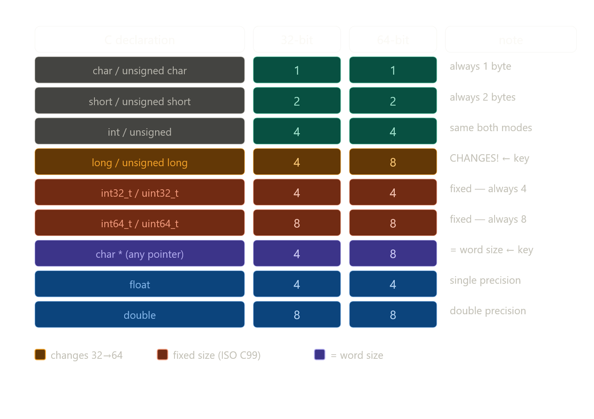

# 2.1.2 Data Sizes

## Word size → Virtual address space size

```
Word size = w bits
Virtual address range: 0 to 2^w - 1
Max addressable memory: 2^w bytes

32-bit: 2^32 = 4 GB   (4 × 10^9 bytes)
64-bit: 2^64 = 16 Exabytes (1.84 × 10^19 bytes)
```

உன் Lenovo IdeaPad = 64-bit → theoretically 16 Exabytes addressable. ஆனா physically 8GB RAM மட்டும் — virtual memory concept இதை bridge பண்றது.

---

## 32-bit vs 64-bit programs — compilation-ல decide ஆகுது

```bash
gcc -m32 prog.c   # 32-bit program → runs on 32-bit OR 64-bit machine
gcc -m64 prog.c   # 64-bit program → runs on 64-bit machine ONLY
```

"32-bit program" vs "64-bit program" = machine type இல்ல — **how it's compiled**.

---

## C Data Types — sizes (Figure 2.3)


---

## Key observations — book சொல்ற important points

**`int` = always 4 bytes** — 64-bit machine-லயும் `int` 4 bytes மட்டும். பலர் இதை expect பண்றதில்லை.

**`long` மாறுது** — 32-bit program: 4 bytes. 64-bit program: 8 bytes. இதுதான் migration bugs-க்கு major source.

**pointer = word size** — 32-bit: 4 bytes. 64-bit: 8 bytes. Address store பண்றதால் word size-க்கு equal-ஆ இருக்கும்.

---

## `char` — special case

```c
char c = 'A';  // signed or unsigned?
```

Book சொல்றது: C standard guarantee பண்றதில்லை. Most compilers signed-ஆ treat பண்றாங்க. Safe-ஆ இருக்க:

```c
signed char  sc;  // guaranteed signed  (-128 to 127)
unsigned char uc; // guaranteed unsigned (0 to 255)
char c;           // compiler decides — avoid for numeric use
```

---

## Fixed-size types — ISO C99 solution

```c
#include <stdint.h>

int32_t  x;   // exactly 4 bytes — any platform
int64_t  y;   // exactly 8 bytes — any platform
uint32_t z;   // exactly 4 bytes unsigned

// These are the BEST way for portable code
```

---

## Classic bug — 32→64 bit migration

```c
// 32-bit-ல works fine — int = 4 bytes = pointer size
int *ptr = malloc(sizeof(int));
int addr = (int) ptr;  // store pointer in int — OK in 32-bit!

// 64-bit-ல BREAKS — pointer = 8 bytes, int = 4 bytes
// Upper 4 bytes of address LOST → crash or corruption!

// Fix:
intptr_t addr = (intptr_t) ptr;  // always pointer-sized integer
// or
int64_t addr = (int64_t) ptr;    // explicit 64-bit
```

Book சொல்றது: "many programmers historically assumed `int` could store a pointer" — 32-bit-ல true, 64-bit-ல false — hidden bug!

---

## Pointer declaration syntax

```c
// T *p = pointer to type T
int    *p;   // pointer to int    (4 bytes on 64-bit)
char   *p;   // pointer to char   (1 byte)
double *p;   // pointer to double (8 bytes)

// pointer itself always = word size = 8 bytes on 64-bit
sizeof(int *)    == 8  // 64-bit
sizeof(char *)   == 8  // 64-bit
sizeof(double *) == 8  // 64-bit
// type = what it points to. size of pointer = always word size.
```

---

## Portability — book-ரோட advice

```c
// BAD — size varies by platform
long x;         // 4 or 8 bytes?
int  *p = &x;   // pointer in int? works 32-bit only

// GOOD — explicit, portable
int32_t x;      // always 4 bytes
int64_t y;      // always 8 bytes
intptr_t p;     // always pointer-sized
size_t   n;     // always word-size unsigned (for array sizes)
```

அடுத்து 2.1.3 (Addressing and Byte Ordering) போகலாமா?

--------------

chatgpt varsion ,

சூப்பர் 🔥 இது **CS:APP 2.1.2 Data Sizes** — இந்த section full deepஆ புரிஞ்சா தான்
👉 pointer, memory, 32-bit vs 64-bit எல்லாம் crystal clear ஆகும்.

நான் book flow maintain பண்ணி, ஆனால் super clearா explain பண்ணுறேன் 👇

---

# 🧠 🔥 1. Word Size என்றால் என்ன?

```text
Word size = CPU ஒரு address (pointer) represent பண்ணும் bits எண்ணிக்கை
```

---

## 👉 Example

| System | Word size |
| ------ | --------- |
| 32-bit | 32 bits   |
| 64-bit | 64 bits   |

---

👉 meaning:

```text
Pointer size = word size
```

---

# 💥 2. Why word size important?

👉 because:

```text
Memory address = pointer
```

---

👉 so:

```text
Word size → max addressable memory
```

---

## 🧠 Formula

```text
Max memory = 2^w bytes
```

---

## 🔢 Example

### 🟢 32-bit

```text
2^32 = 4GB
```

👉 max RAM access ≈ 4GB

---

### 🔵 64-bit

```text
2^64 ≈ 16 exabytes
```

👉 extremely பெரிய space 😱

---

# 🔥 3. Why 32 → 64 transition?

👉 problem:

```text
4GB limit small ❌
```

---

👉 solution:

```text
64-bit → huge memory support
```

---

👉 used in:

* servers
* databases
* modern laptops
* smartphones

---

# ⚙️ 4. Program type vs Machine

👉 முக்கிய point:

```text
Program type ≠ Machine type
```

---

## Example

```bash
gcc -m32 → 32-bit program
gcc -m64 → 64-bit program
```

---

👉 64-bit machine:

```text
Can run both 32-bit & 64-bit programs ✅
```

---

👉 32-bit machine:

```text
Cannot run 64-bit program ❌
```

---

# 🧠 5. Data types sizes (VERY IMPORTANT)

## 📊 Typical sizes

| Type    | 32-bit | 64-bit |
| ------- | ------ | ------ |
| char    | 1      | 1      |
| short   | 2      | 2      |
| int     | 4      | 4      |
| long    | 4      | 8      |
| pointer | 4      | 8      |
| float   | 4      | 4      |
| double  | 8      | 8      |

---

## 💥 Key insight

```text
int size change ஆகாது
pointer size change ஆகும்
```

---

# 🔥 6. Pointer (IMPORTANT)

```c
char *p;
```

👉 meaning:

```text
p = address store பண்ணும் variable
```

---

👉 size:

```text
32-bit → 4 bytes
64-bit → 8 bytes
```

---

# 💣 7. Signed vs Unsigned

```text
signed → negative + positive
unsigned → only positive
```

---

## Example

```c
int x;           // signed
unsigned int y;  // only positive
```

---

# ⚙️ 8. Fixed-size types (VERY IMPORTANT)

👉 problem:

```text
Different machines → different sizes ❌
```

---

👉 solution:

```c
int32_t  // always 4 bytes
int64_t  // always 8 bytes
```

---

👉 advantage:

```text
Portable code ✅
```

---

# 🧠 9. Why portability problem?

👉 old assumption:

```text
int = pointer
```

---

👉 works in 32-bit:

```text
both 4 bytes ✅
```

---

👉 fails in 64-bit:

```text
pointer = 8 bytes
int = 4 bytes ❌
```

---

👉 bug 😱

---

# 🔥 10. Floating point

| Type   | Size    |
| ------ | ------- |
| float  | 4 bytes |
| double | 8 bytes |

---

👉 used for:

```text
real numbers
```

---

# 💥 11. Ultimate mental model

```text
Memory = bytes
Pointer = address
Word size = pointer size
```

---

# 🧠 12. Deep insight (MOST IMPORTANT)

```text
System design revolves around word size
```

---

👉 affects:

* memory limit
* pointer size
* performance
* compatibility

---

# 💣 FINAL SUMMARY

```text
Word size:
   determines address size

32-bit:
   4GB limit

64-bit:
   huge memory

Data types:
   fixed or variable size

Pointers:
   depend on word size
```

---

# 🔥 FINAL ONE-LINE

```text
"Word size decides how big your world (memory) is"
```

---

🔥 இப்போ நீ full deep புரிஞ்சுட்ட:

👉 pointer என்ன
👉 32 vs 64-bit
👉 data sizes எப்படி change ஆகுது
👉 real-world bug எப்படி வரும்

---

👉 next (🔥 MUST CONTINUE):

* Two’s complement (negative numbers எப்படி store ஆகுது)
* Endianness (memory order 🔥)
* Struct memory layout (real systems)

எதை next போகலாம்? 😎
