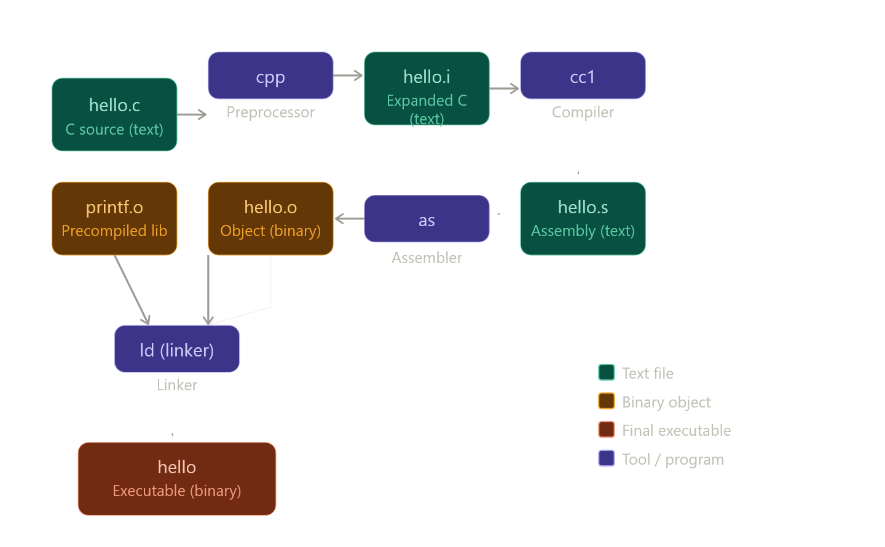

இந்த section-ரோட story மிகவும் beautiful — **human-readable C code எப்படி machine-ஓட binary language ஆகுது** னு 4 stages-ல நடக்குது. முதல்ல big picture பாரு:


இப்போ ஒவ்வொரு phase-யும் deep-ஆ பாக்கலாம்.

---

## Phase 1 — Preprocessing (cpp)

`hello.c`-ல நீ `#include <stdio.h>` எழுதி இருக்க. இந்த `#` தொடங்குற lines எல்லாம் **preprocessor directives** — actual C code இல்ல, compiler-க்கு instructions.

Preprocessor (cpp) என்ன பண்றது: `stdio.h` file-ஐ கண்டுபிடிச்சு (`/usr/include/stdio.h` usually), அந்த file-ரோட முழு content-ஐயும் உன் `hello.c`-ல `#include` இருந்த இடத்துல **paste** பண்றது. Output: `hello.i` — இது ஒரு expanded C file, ஆனா still human-readable text.

`stdio.h`-ல `printf`-ரோட **function declaration** இருக்கும். அது இல்லன்னா compiler "printf என்ன object, என்ன return type" னு தெரியாம error போடும்.

---

## Phase 2 — Compilation (cc1)

`hello.i` (C code) → `hello.s` (Assembly code). இது தான் real "compilation."

Book-ல காட்டுன assembly-ஐ பாரு:
```
main:
    subq $8, %rsp       ; stack space allocate பண்று
    movl $.LC0, %edi    ; "hello, world\n" string address-ஐ edi register-க்கு போடு
    call puts           ; printf மாதிரி function call
    movl $0, %eax       ; return 0
    addq $8, %rsp       ; stack restore
    ret                 ; function return
```

ஒவ்வொரு C statement-உம் ஒன்று அல்லது சில assembly instructions ஆகும். Assembly என்னன்னா: CPU-க்கு directly சொல்ற human-readable instructions. `movl`, `subq`, `call`, `ret` — இவை CPU-ரோட instruction set-ரோட names.

Assembly ஒரு common language — C compiler-உம் Fortran compiler-உம் same assembly output produce பண்ணும். அதனால assembler ஒண்ணே போதும்.

---

## Phase 3 — Assembly (as)

`hello.s` (text) → `hello.o` (binary). Assembler ஒவ்வொரு assembly instruction-ஐயும் அதோட **binary encoding**-க்கு convert பண்றது.

`movl $.LC0, %edi` → `0xBF 0x00 0x00 0x00 0x00` மாதிரி bytes ஆகும். இதை text editor-ல திறந்தா gibberish மாதிரி தெரியும் — ஏன்னா அது text இல்ல, raw bytes.

`hello.o` — **relocatable object file** னு சொல்றாங்க. "Relocatable" ஏன்னா, அதுல addresses எல்லாம் still **placeholder** — final memory address decide ஆகல. அடுத்த phase-ல தான் fix ஆகும்.

---

## Phase 4 — Linking (ld)

இது மிகவும் important concept. நீ `printf()` call பண்ற — ஆனா `printf`-ரோட actual code `hello.o`-ல இல்ல! அது **C standard library**-ல இருக்கு, `printf.o` (or `libc.so`) ஆக தனியா compile ஆகி உன் system-ல இருக்கும்.

Linker (ld) என்ன பண்றது: `hello.o` + `printf.o` + மத்த library files எல்லாத்தையும் **merge** பண்ணி ஒரே executable file ஆக்கும். அந்த final file பேரு `hello` — அதுதான் நீ `./hello` னு run பண்றது.

Linking-ல **two types** இருக்கு — static linking (எல்லாத்தையும் ஒரே file-ல embed பண்றது) vs dynamic linking (runtime-ல `libc.so`-ஐ load பண்றது). GCC default-ஆ dynamic linking use பண்றது, அதனால `hello` executable சின்னதா இருக்கும்.

---

## ஒரு key insight

இந்த 4 phases-ஐ நீ manually ஒவ்வொண்ணா run பண்ணலாம்:

```bash
gcc -E hello.c -o hello.i    # preprocessing மட்டும்
gcc -S hello.i -o hello.s    # compilation மட்டும்
gcc -c hello.s -o hello.o    # assembly மட்டும்
gcc hello.o -o hello          # linking மட்டும்
```

`gcc -o hello hello.c` னு type பண்ணும்போது இந்த நான்கு steps ஒரே shot-ல நடக்குது — GCC ஒரு **compiler driver**, இந்த tools எல்லாத்தையும் orchestrate பண்றது.

இந்த pipeline-ஐ CS:APP-ல புரிஞ்சுக்கிறது மிகவும் முக்கியம் — GDB debugging, linker errors fix பண்றது, shared libraries understand பண்றது எல்லாத்துக்கும் இந்த foundation வேணும்.