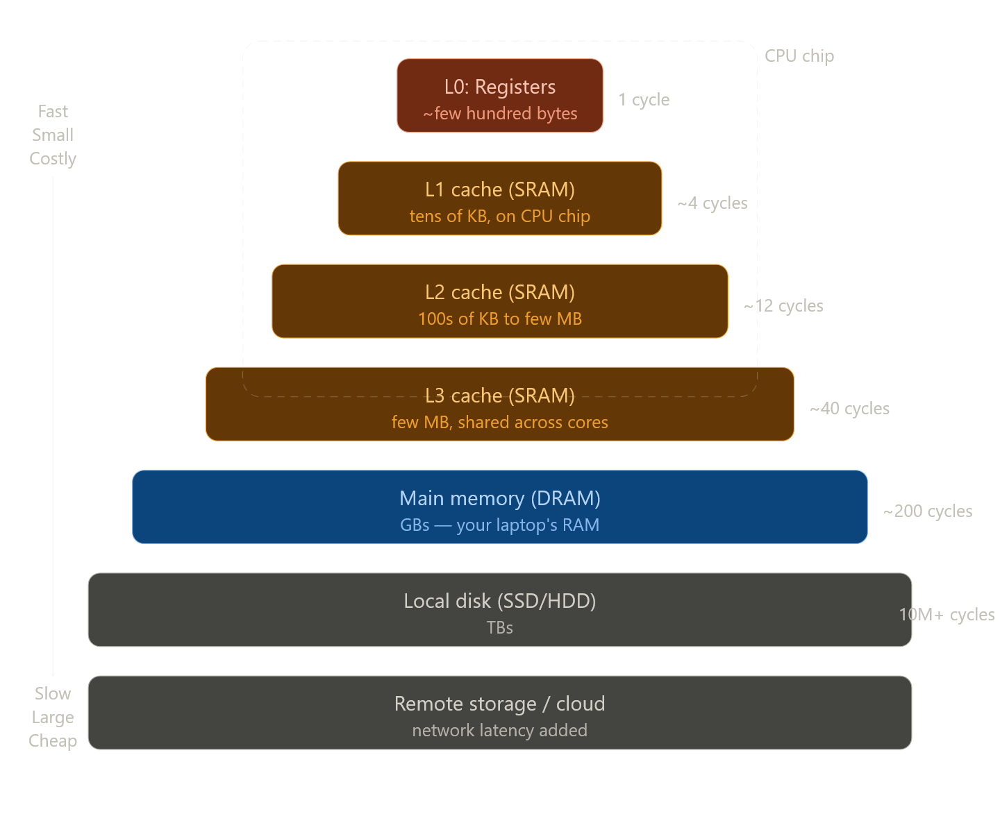

இந்த section-ரோட core question ஒண்ணே ஒண்ணுதான்: **CPU மிகவும் fast, Memory மிகவும் slow — இந்த gap-ஐ எப்படி fix பண்றது?**

இதை விளங்க முதல்ல speed comparison பாரு:

| Storage | Read speed (CPU perspective) |
|---|---|
| Register | ~1 cycle |
| L1 Cache | ~4 cycles |
| L2 Cache | ~12 cycles |
| RAM | ~100–200 cycles |
| Disk | ~10,000,000 cycles |

Disk-ஐ விட RAM **10,000x** fast. ஆனா CPU-ஐ விட RAM **100x** slow. இந்த gap problem-தான் "processor–memory gap" னு சொல்றாங்க.

இப்போ memory hierarchy எப்படி solve பண்றது னு visual-ஆ பாக்கலாம்:இப்போ concept-ஐ deep-ஆ பாக்கலாம்.

---

## ஏன் bigger = slower? (Physical law)

இது physics. ஒரு storage device பெரிசா இருந்தா, data-ஐ படிக்க **electrical signal** அதிக distance travel பண்ணணும். அந்த travel time = latency. Registers CPU-க்கு literally attached, so nanoseconds. Disk-ல data பல centimeters தூரத்துல இருக்கும், access slow.

SRAM (cache-ல use ஆகுது) vs DRAM (RAM-ல use ஆகுது) difference: SRAM ஒரு bit-ஐ store பண்ண 6 transistors வேணும் — fast ஆனா expensive. DRAM ஒரு bit-ஐ store பண்ண 1 transistor + 1 capacitor — cheap ஆனா refresh cycle தேவைப்படுது, அதனால slow.

---

## Cache எப்படி trick பண்றது — Locality principle

Cache-ரோட magic **"locality"** னு ஒரு observation-ல இருந்து வருது:

Programs typically access data in **predictable patterns**:

**Temporal locality** — நீ ஒரு variable-ஐ use பண்ணன்னா, soon again use பண்ணுவ. Example: `for` loop-ல `i` variable ஒவ்வொரு iteration-லயும் use ஆகுது.

**Spatial locality** — நீ ஒரு memory address access பண்ணன்னா, அதோட neighbours-ஐ soonil access பண்ணுவ. Example: array-ல `arr[0]` access பண்ணன்னா `arr[1]`, `arr[2]` soon வரும்.

Cache இந்த pattern-ஐ exploit பண்றது. CPU ஒரு data-ஐ RAM-லிருந்து fetch பண்ணும்போது, அந்த data மட்டும் cache-ல போடாது — அடுத்து இருக்கற data-ஐயும் சேர்த்து ஒரு **cache line** (~64 bytes) pull பண்ணும். அடுத்த request வரும்போது already cache-ல இருக்கும் — **cache hit**. இல்லன்னா **cache miss**, RAM-லிருந்து மறுபடியும் fetch.

---

## `hello` program-ல cache எப்படி matter ஆகுது

Book-ல சொன்ன hello program flow recall பண்ணு: `"hello, world\n"` string disk-லிருந்து → RAM-க்கு → CPU registers-க்கு போயி display-ல print ஆச்சு. இந்த string second time print பண்ணா? RAM-க்கே போகாம L1/L2 cache-லிருந்தே வரும் — orders of magnitude faster.

இந்த insight-தான் CS:APP-ரோட core theme: **cache-aware programming** பண்ணன்னா program-ஐ 10x வரை fast ஆக்கலாம், hardware மாத்தாமலே. இதை Chapter 6-ல book deep-ஆ cover பண்ணும்.