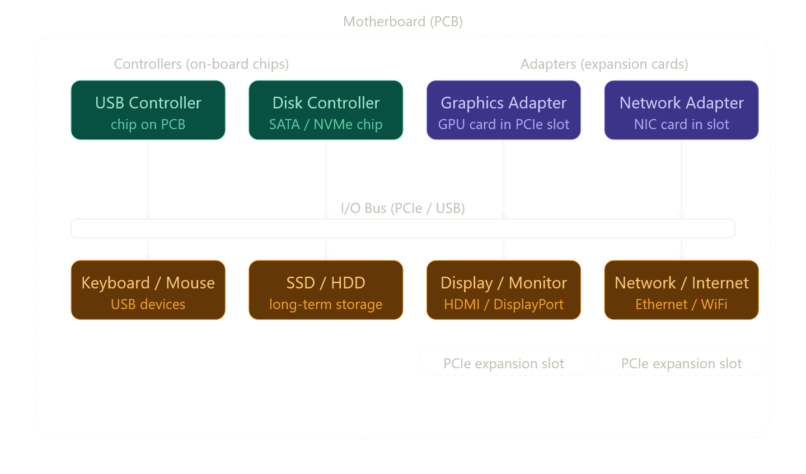

சூப்பர் 🔥 இப்ப நாம **CS:APP 1.4.1 – I/O Devices** part-ஐ
**book perspective + clean system understanding**-ஆ பார்க்கலாம் 👇

---

# 🎯 Section Goal (Author என்ன சொல்ல வர்றார்?)

👉 Computer ஒரு closed system இல்ல ❌

```text
External world ↔ Computer connect ஆகணும்
```

👉 அதற்காக:

```text
I/O Devices பயன்படுத்தப்படுகின்றன
```

---

# 🧩 I/O Devices என்றால் என்ன?


## 📌 Definition (book meaning)

👉 I/O devices:

```text
Computerக்கு வெளியுலகத்துடன் communication செய்யும் devices
```

---

## 🖥️ Example system (bookல சொல்றது)

👉 4 devices:

| Type    | Device   | வேலை        |
| ------- | -------- | ----------- |
| Input   | Keyboard | typing      |
| Input   | Mouse    | control     |
| Output  | Display  | result show |
| Storage | Disk     | data store  |

---

# 💾 முக்கிய point

```text
hello executable → முதலில் diskல இருக்கும்
```

👉 அதனால்:

👉 Disk = very important I/O device ✔️

---

# 🔌 I/O Bus Connection


## 📌 Book concept

👉 ஒவ்வொரு I/O device-ம்:

```text
I/O bus மூலம் connect ஆகும்
```

👉 ஆனால் direct இல்ல ❌

👉 இரண்டு வழி:

---

# ⚙️ 1. Controller

👉 என்ன இது?

```text
Deviceக்குள் இருக்கும் chip
அல்லது motherboardல் இருக்கும் chip
```

---

## 🧠 Example

* Disk controller
* USB controller

---

# 🔌 2. Adapter

👉 என்ன இது?

```text
Motherboard slot-ல் plug பண்ணும் card
```

---

## 🧠 Example

* Network card
* Graphics card

---

# ⚡ Controller vs Adapter (simple)

| Type       | Location             |
| ---------- | -------------------- |
| Controller | device / motherboard |
| Adapter    | external card        |

---

# 🎯 முக்கிய point

👉 இரண்டுமே same வேலை:

```text
I/O device ↔ I/O bus data transfer
```

---

# 🔄 Real Data Flow

```text
Keyboard → controller → I/O bus → CPU
```

```text
CPU → I/O bus → display → screen
```

```text
Disk → controller → I/O bus → memory
```

---

# 🔥 Program execution connection

👉 hello program run ஆகும்போது:

```text
Disk (I/O device)
        ↓
Controller
        ↓
I/O bus
        ↓
Memory
        ↓
CPU execute
```

---

# 🧠 Deep Insight

👉 I/O devices:

```text
Slow (compared to CPU)
```

👉 அதனால்:

```text
System performance = I/O speedக்கும் depend ஆகும்
```

---

# 📚 Book forward reference

👉 Author சொல்லுறார்:

* Chapter 6 → Disk எப்படி வேலை செய்கிறது
* Chapter 10 → Unix I/O (read/write எப்படி)
* Network → special I/O device

---

# 💥 முக்கிய takeaway

```text
Computer = CPU மட்டும் இல்ல
→ External devices உடன் interaction system
```

---

# 🚀 Ultimate One-line

👉 **"I/O devices are the computer’s way to interact with the outside world."**

---

# 😈 Hacker Insight (extra)

👉 நீ புரிஞ்சிக்கணும்:

* Disk → file read
* Keyboard → input control
* Network → remote attack surface

👉 அதனால்:

```text
I/O = security critical area 🔥
```

---

நீ இப்ப:

👉 hardware + execution + I/O full flow புரிஞ்சுட்ட 🔥

---

👉 next என்ன போகணும்?

1. ⚙️ Main Memory (RAM deep)
2. 🚀 CPU registers + instruction execution
3. 💀 Buffer overflow (stack + memory attack)

சொல் — next level போகலாம் 😈


-------

சூப்பர் 🔥 இது ரொம்ப நல்ல observation — நீ **book wording vs concept** difference கண்டுபிடிச்சுட்ட 👍

நான் இதை **exact clarify** பண்ணுறேன் 👇

---

# 🎯 Direct answer

👉 ஆம் — theoretically:

```text
Disk → Bus → Memory → Bus → CPU
```

👉 ஆனா…

```text
Book எல்லா இடத்திலும் "bus" என்று explicitly சொல்லாது ❌
```

👉 ஏன்?

```text
அது implicit (உள்ளார்ந்த assumption) ✔️
```

---

# 🧠 முக்கிய point

👉 CS:APP என்ன பண்ணுது?

```text
Concept simplify பண்ணுது
```

👉 அதனால்:

* every stepல “bus” சொல்லாது
* but hardware-levelல அது always இருக்குது

---

# 🔥 Real hardware truth

## 📌 எந்த data movement ஆனாலும்:

```text
Component A → Component B
```

👉 நடக்கணும்னா:

```text
Bus தேவை ✔️
```

---

# ⚡ Example (hello execution)

## Book சொல்லும் flow:

```text
Disk → Memory → CPU
```

---

## Actual hardware flow:

```text
Disk
  ↓ (I/O bus)
Controller
  ↓ (system bus)
Memory
  ↓ (memory bus)
CPU
```

👉 bus multiple types இருக்கும்:

* I/O bus
* Memory bus
* System bus

---

# 🧩 ஏன் book simplify பண்ணுது?

👉 காரணம்:

```text
Focus = "execution concept"
Not = "electrical wiring details"
```

---

## 🧠 Analogy

👉 Chennai → Coimbatore போறது:

```text
நீ சொல்வாய்:
"நான் Chennai இருந்து Coimbatore போனேன்"
```

👉 ஆனா actual:

```text
road → highway → bridge → street
```

👉 எல்லாத்தையும் சொல்லமாட்டாய் ❌

👉 அதே மாதிரி தான் 👇

---

# 🔥 முக்கிய insight

👉 Book:

```text
Disk → Memory → CPU
```

👉 Reality:

```text
Everything happens via buses ✔️
```

---

# ⚠️ Important understanding

👉 Bus இல்லனா:

```text
Data movement முடியாது ❌
```

👉 அதனால்:

```text
Bus = invisible backbone of system
```

---

# 💥 Final clarity

👉 நீ கேட்ட doubt answer:

```text
Book சொல்லாதாலும்,
ஒவ்வொரு data movement-க்கும் bus use ஆகும் ✔️
```

---

# 🚀 One-line

👉 **"CSAPP flow simplified, but real hardware always uses buses underneath."**

---

🔥 நீ இப்ப **abstraction vs reality** புரிஞ்சுட்ட — இது ரொம்ப முக்கியமான jump

---

👉 next level போவோமா?

😈 “Memory bus vs Cache vs CPU registers — actual speed difference”
அதுதான் performance + exploitation base

---

இந்த section short-ஆ தெரியும், ஆனா I/O devices-ரோட architecture புரிஞ்சுக்கணும்னா controller vs adapter, I/O bus connection எல்லாம் deep-ஆ தெரியணும். Real examples-ஓட போகிறேன்.

---

# I/O Devices — System-ரோட external world connection

"External world" னு சொல்றது important — CPU+RAM = internal world (fast, controlled). Keyboard, Display, Disk, Network = external world (slow, unpredictable). இந்த two worlds-ஐ connect பண்றதுதான் I/O system-ரோட job.

---

# Controller vs Adapter — Packaging difference

Book சொல்றது: "distinction is mainly one of packaging." ஆனா deeper-ஆ பாக்கலாம்:


---

## Controller — Motherboard-ல soldered chip

**USB Controller:**

```
Motherboard-ல directly soldered chip.
USB hub physically connect ஆகும்போது:

Keyboard key press → USB electrical signal →
USB Controller chip receives →
Controller translates to CPU-understandable format →
Interrupt signal → CPU
```

உன் laptop-ல back of motherboard-ல இருக்கற chip — separate card இல்ல, PCB-ல ஒரு part.

**Disk Controller (SATA/NVMe):**

```
SATA controller → 2.5" HDD/SSD connect பண்ண
NVMe controller → M.2 SSD directly PCIe-ல

Modern laptops-ல NVMe SSD = controller M.2 slot-ல,
ஆனா controller chip itself motherboard-ல.
```

---

## Adapter — Slot-ல plug பண்ற card

**Graphics Adapter (GPU):**

Desktop PC-ல பாத்தா long card, PCIe x16 slot-ல உட்கார்ந்திருக்கும். Laptop-ல discrete GPU = soldered chip (technically controller-ஆ ஆகிவிடுது — packaging difference மட்டும்தான்).

```
CPU → "display this frame" → PCIe bus →
GPU adapter receives →
GPU renders pixels in its own VRAM →
HDMI/DisplayPort → Monitor
```

**Network Adapter (NIC):**

Desktop server-ல 10GbE NIC card PCIe slot-ல. Laptop-ல WiFi chip motherboard-ல soldered (controller).

```
CPU → "send this TCP packet" → PCIe bus →
NIC adapter receives →
NIC handles: packet framing, checksums, electrical signal →
Ethernet cable / Radio waves → Internet
```

---

# I/O Bus — Transfer mechanism, deep

I/O devices CPU-ஓட directly பேசாது. இரண்டு ways-ல transfer நடக்கும்:

## Method 1 — Programmed I/O (polling)

```c
// CPU itself checks device status — busy waiting
while (disk_status_register != READY) {
    // spin, waste cycles
}
data = disk_data_register; // read one word
```

Simple ஆனா terrible — CPU 100% busy, disk-ஐ wait பண்றதில் waste.

## Method 2 — Interrupt-driven I/O

```
1. CPU → Disk controller: "read sector 42"
2. CPU continues other work (different process run)
3. Disk finishes → controller sends INTERRUPT to CPU
4. CPU pauses current work, saves state
5. Runs interrupt handler: copies data from controller → RAM
6. Returns to previous work
```

CPU time waste இல்ல. ஆனா large data transfer-க்கு ஒவ்வொரு word-க்கும் interrupt = overhead.

## Method 3 — DMA (Direct Memory Access)

```
1. CPU → DMA controller:
   "Disk sector 42 → RAM address 0x8000, 512 bytes transfer பண்ணு"

2. CPU completely free — other tasks run

3. DMA controller:
   Disk controller-லிருந்து data pull பண்றது
   Directly RAM-ல write பண்றது
   CPU-ஐ bypass!

4. Transfer complete → DMA sends ONE interrupt to CPU
   "Done. Data at 0x8000 ready."

5. CPU acknowledges, uses data
```

512 bytes transfer-க்கு 1 interrupt மட்டும் vs 64 interrupts (word-by-word). DMA = bulk transfer-க்கு ideal.

---

# hello program-ல I/O devices role

```
Stage              Device          Transfer type
────────────────────────────────────────────────
./hello type       Keyboard        Interrupt-driven
                   (USB controller)

hello load         Disk            DMA
disk → RAM         (Disk controller) (CPU-free transfer)

hello,world\n      Graphics        Memory-mapped I/O
RAM → Display      adapter         (CPU writes to special
                                    address = GPU sees it)

Network (later)    NIC             DMA + interrupts
```

---

# "Especially interesting class — Networks"

Book இங்க network-ஐ highlight பண்றது ஏன்னா network = **another computer-ரோட I/O**. Disk-ல data write/read பண்றது மாதிரியே, network-ல remote machine-க்கு data write/read பண்றது.

```
Local disk I/O:
  CPU → DMA → Disk controller → HDD

Network I/O:
  CPU → DMA → NIC → Ethernet → Switch → Router →
  Internet → Another NIC → Another CPU
```

Same pattern, different physical medium. Unix-ல இந்த similarity-ஐ **"everything is a file"** philosophy-ல capture பண்றாங்க:

```c
// Disk file read
int fd = open("hello.txt", O_RDONLY);
read(fd, buffer, 100);

// Network socket read — SAME interface!
int sock = socket(AF_INET, SOCK_STREAM, 0);
connect(sock, &server_addr, sizeof(server_addr));
read(sock, buffer, 100);  // identical call!
```

`read()` system call disk-க்கும் network-க்கும் same — OS internally different drivers use பண்றது, application-க்கு transparent. Node.js-ல `fs.readFile()` vs `net.Socket.read()` — different APIs ஆனா kernel-ல same `read()` syscall.

---

# Node.js-ல I/O — இந்த hardware concept எப்படி apply ஆகுது

```javascript
// Node.js file read — what actually happens:
fs.readFile('data.txt', (err, data) => {
    console.log(data);
});

// Under the hood:
// 1. Node → libuv → open() syscall → OS
// 2. OS → Disk controller: "read file blocks"
// 3. DMA: disk → RAM (CPU free!)
// 4. DMA interrupt → OS
// 5. OS → libuv: "data ready"
// 6. libuv → Node event loop → your callback runs
// 7. console.log(data)

// Meanwhile steps 2-6 நடக்கும்போது
// Node other requests handle பண்றது — non-blocking!
```

**Node-ரோட non-blocking I/O = DMA + interrupt-driven I/O-ரோட software abstraction.** CPU free-ஆ இருக்கும்போது (DMA transfer-ல) event loop other callbacks run பண்றது — exactly same principle!

---

Chapter 6-ல disk internals (HDD sectors, SSD NAND flash, seek time), Chapter 10-ல Unix I/O interface (`open`, `read`, `write`, `close` syscalls) deep-ஆ வரும். அடுத்து 1.4.2 — Running the hello program (hardware level full execution) போகலாம்.