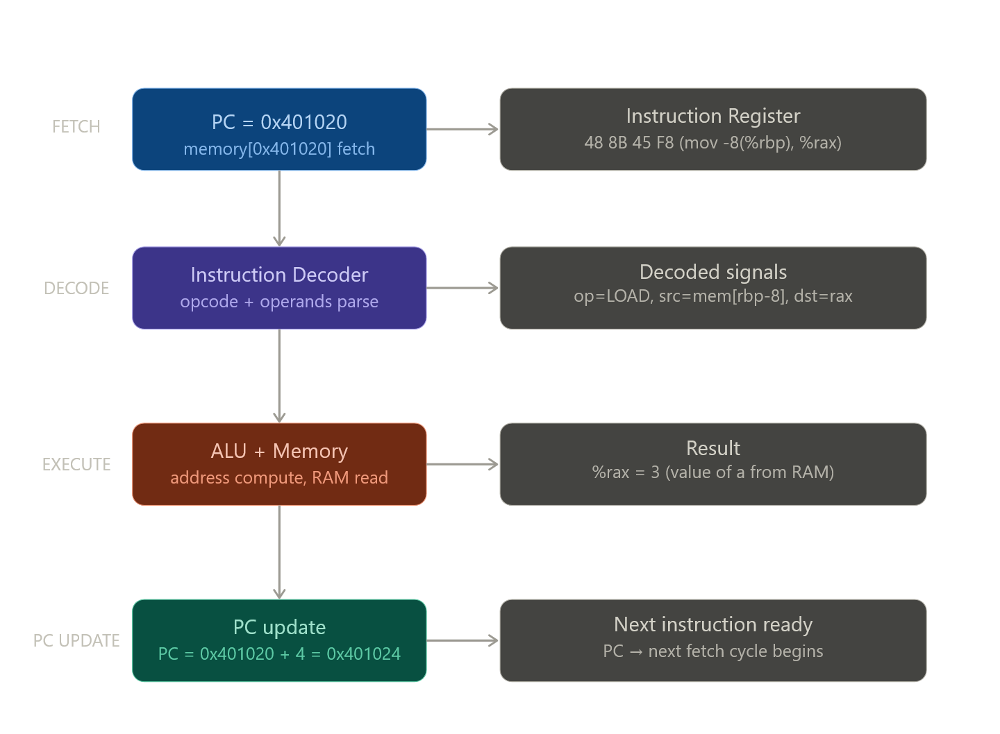

இந்த section-தான் CS:APP-ரோட heart. CPU எப்படி work ஆகுது, 4 basic operations என்ன, ISA vs Microarchitecture difference — எல்லாத்தையும் real examples-ஓட deep-ஆ போகிறேன்.

---

# CPU-ரோட Core Loop — Power ON to Power OFF

Book சொல்றது: "From the time that power is applied until power is shut off, a processor repeatedly executes instructions."

இது literally infinite loop:

```c
// CPU-ரோட hardware behaviour (pseudocode)
while (power_is_on) {
    instruction = memory[PC];   // Fetch
    PC = PC + sizeof(instruction); // PC advance (default)
    execute(instruction);        // Decode + Execute
    // (execute may modify PC again — jmp, call, ret)
}
```

இந்த loop ஒரு 3GHz CPU-ல **3 billion times per second** நடக்குது. ஒவ்வொரு iteration = one clock cycle (ideally).

---

# Fetch → Decode → Execute — Real trace

`int c = a + b;` (a=3, b=7, both in memory) execute ஆகும்போது:


---

# 4 Basic Operations — Deep Examples

## Operation 1: LOAD

```
Memory → Register

Instruction: mov -8(%rbp), %rax
Meaning: RAM[rbp - 8] -ல இருக்கற value → %rax-ல போடு

Execution:
  1. ALU: address = %rbp - 8 = 0x7fff1008 - 8 = 0x7fff1000
  2. Memory read: RAM[0x7fff1000] = 0x0000000000000003 (value 3)
  3. %rax = 3

Before:  %rax = ??? (garbage)
After:   %rax = 3
RAM:     unchanged
```

Load-ல **L1 cache** முதல்ல check ஆகும். Cache hit → ~4 cycles. Cache miss → RAM → ~200 cycles. இதுதான் performance-ல மிகவும் expensive operation.

---

## Operation 2: STORE

```
Register → Memory

Instruction: mov %rax, -24(%rbp)
Meaning: %rax-ல இருக்கற value → RAM[rbp - 24]-ல போடு

Execution:
  1. ALU: address = %rbp - 24 = 0x7fff1008 - 24 = 0x7ffff0F0
  2. Memory write: RAM[0x7fff0F0] = %rax = 10
  3. Register unchanged

Before:  RAM[0x7fff0F0] = ???
After:   RAM[0x7fff0F0] = 10
%rax:    still 10 (unchanged)
```

Store-உம் cache வழியா போகும். **Write-back cache** — cache-ல write பண்ணும், RAM-க்கு immediately போகாது. Later eviction-ல RAM update ஆகும்.

---

## Operation 3: OPERATE (ALU)

```
Register + Register → ALU → Register

Instruction: add %rbx, %rax
Meaning: %rax = %rax + %rbx

Execution:
  1. Register file: read %rax = 3, read %rbx = 7
  2. ALU: 3 + 7 = 10
  3. FLAGS update:
     ZF (Zero Flag)  = 0  (result ≠ 0)
     SF (Sign Flag)  = 0  (result positive)
     OF (Overflow)   = 0  (no overflow)
     CF (Carry Flag) = 0  (no carry)
  4. %rax = 10
  RAM: NOT touched — pure register operation
```

ALU operations: `add`, `sub`, `imul`, `and`, `or`, `xor`, `shl`, `shr`, `cmp`, `test`. எல்லாம் registers மட்டும் — RAM touch இல்ல — அதனால ~1 cycle.

---

## Operation 4: JUMP

```
Immediate value → PC

Instruction: jmp 0x401050
Meaning: next instruction PC = 0x401050 (unconditional)

Execution:
  PC = 0x401050
  Next fetch: memory[0x401050]

Conditional jump example:
  cmp $0, %rax      ; %rax == 0?
  je  0x401070      ; if yes, PC = 0x401070
                    ; if no,  PC = next instruction
```

Jump = PC manipulation. `call` (function call) = jump + return address stack-ல push. `ret` = PC = stack-லிருந்து pop.

---

# `int c = a + b` — Full instruction sequence

```c
int a = 3;   // stack: rbp-8
int b = 7;   // stack: rbp-12
int c = a + b; // stack: rbp-16
```

Assembly full trace:

```asm
; Setup stack frame
push  %rbp              ; save caller's base pointer
mov   %rsp, %rbp        ; set our base pointer
sub   $16, %rsp         ; allocate 16 bytes for locals

; int a = 3
mov   $3, -4(%rbp)      ; STORE: RAM[rbp-4] = 3

; int b = 7
mov   $7, -8(%rbp)      ; STORE: RAM[rbp-8] = 7

; int c = a + b
mov   -4(%rbp), %eax    ; LOAD:    eax = RAM[rbp-4] = 3
mov   -8(%rbp), %edx    ; LOAD:    edx = RAM[rbp-8] = 7
add   %edx, %eax        ; OPERATE: eax = 3 + 7 = 10
mov   %eax, -12(%rbp)   ; STORE:   RAM[rbp-12] = 10

; return
mov   $0, %eax          ; return value = 0
leave                   ; restore stack
ret                     ; JUMP: PC = return address
```

ஒரு simple `c = a + b` → **9 instructions**, multiple LOAD/STORE/OPERATE/JUMP operations. Compiler optimization (`-O2`) இதை:

```asm
; Optimized — registers மட்டும்!
mov  $3, %eax    ; eax = 3
add  $7, %eax    ; eax = 10
; c never stored to RAM if not needed!
```

3 instructions-ஆ குறைக்கும். RAM access completely eliminate!

---

# ISA vs Microarchitecture — மிக Important Distinction

Book-ல சொல்றது: "processor *appears* to be a simple implementation of its ISA, but in fact uses far more complex mechanisms."

## ISA (Instruction Set Architecture)

**Contract between software and hardware.** "இந்த instruction இதை பண்ணும்" னு specification.

```
x86-64 ISA:
  add %rbx, %rax → %rax = %rax + %rbx
  That's it. How? Don't care.

ARM ISA:
  ADD R0, R1, R2 → R0 = R1 + R2
  Different syntax, different binary encoding,
  same concept.
```

ISA = **programmer/compiler-ரோட view.**

## Microarchitecture

**How the ISA is actually implemented in silicon.** Same ISA, different microarchitectures possible.

```
Intel Core i9 (Raptor Lake microarch):
  add instruction →
  Out-of-order execution engine receives
  Register renaming (avoid false dependencies)
  Reservation station queues the op
  Execution unit picks it up
  Result forwarding (bypass network)
  Retirement in-order
  All this for ONE add instruction!

Intel Atom (small core, different microarch):
  Same add instruction →
  Simpler in-order execution
  Less hardware, less power
  Same ISA, totally different silicon
```

---

# Superscalar + Pipelining — Modern CPU-ரோட real mechanism

Book "Chapter 4 has more to say" னு சொல்றது. Preview:

```
Simple model (what book describes for now):
Cycle 1: Fetch instr1
Cycle 2: Decode instr1
Cycle 3: Execute instr1
Cycle 4: Fetch instr2    ← 4 cycles per instruction!
...

Real CPU — Pipeline:
Cycle 1: Fetch  instr1
Cycle 2: Decode instr1  | Fetch  instr2
Cycle 3: Exec   instr1  | Decode instr2  | Fetch  instr3
Cycle 4: WB     instr1  | Exec   instr2  | Decode instr3  | Fetch instr4
→ 1 instruction per cycle throughput!

Modern Superscalar (multiple execution units):
Cycle 1: Execute instr1 + instr2 + instr3 simultaneously!
→ 3+ instructions per cycle!
```

Intel Core i9 = 6-wide superscalar, 19-stage pipeline. ஒரு clock cycle-ல 6 instructions simultaneously execute.

---

# Branch Prediction — Jump-ரோட hidden complexity

```c
for (int i = 0; i < 1000000; i++) {
    if (arr[i] > 0) sum += arr[i];  // branch here!
}
```

Pipeline-ல `if` condition result தெரியும் முன்னே CPU already next instructions fetch பண்ணி execute பண்ணிட்டிருக்கும் (**speculative execution**). Wrong prediction = pipeline flush = ~15 cycle penalty.

**Branch predictor** — hardware-ல pattern learn பண்றது. Loop usually taken → predict taken. 99% accuracy modern CPUs-ல.

```
Sorted array:   [1,2,3...500, -1,-2...-500]
  Branch: first 500 always taken, last 500 never taken
  Predictor learns → ~1 misprediction total
  Fast!

Unsorted array: [3,-1,2,-4,1,-2...]
  Branch: random pattern
  Predictor wrong ~50% time
  Each wrong = 15 cycle penalty × 500000 = millions of wasted cycles
  Slow!
```

இதுதான் **Spectre vulnerability** (2018) — speculative execution-ஐ exploit பண்ணி secret data leak பண்றது. Microarchitecture feature → security hole — exact same pattern!

---

# Node.js-க்கு Connection

```javascript
// V8 engine உள்ளே:

function add(a, b) { return a + b; }

// First few calls — V8 interprets (slow)
add(3, 7);

// After many calls with same types — JIT compile!
// V8 generates x86-64 machine code:
// mov %rdi, %rax
// add %rsi, %rax
// ret
// Same ISA, same fetch-decode-execute cycle!

// Type change → deoptimize!
add("hello", 7);  // was int+int, now string+int
// JIT-compiled code thrown away, back to interpreter
// அதனால JS-ல type consistency = performance
```

V8-ரோட JIT compiler same x86-64 ISA-க்கு code generate பண்றது — அதே fetch-decode-execute cycle-ல run ஆகுது. ISA knowledge = JS performance understanding.

அடுத்து 1.4.2 (Running the hello program) போகலாம் — இந்த எல்லா concepts-உம் combine ஆகி `./hello` run ஆகும்போது hardware-ல step-by-step என்ன நடக்குது னு full picture கிடைக்கும்.