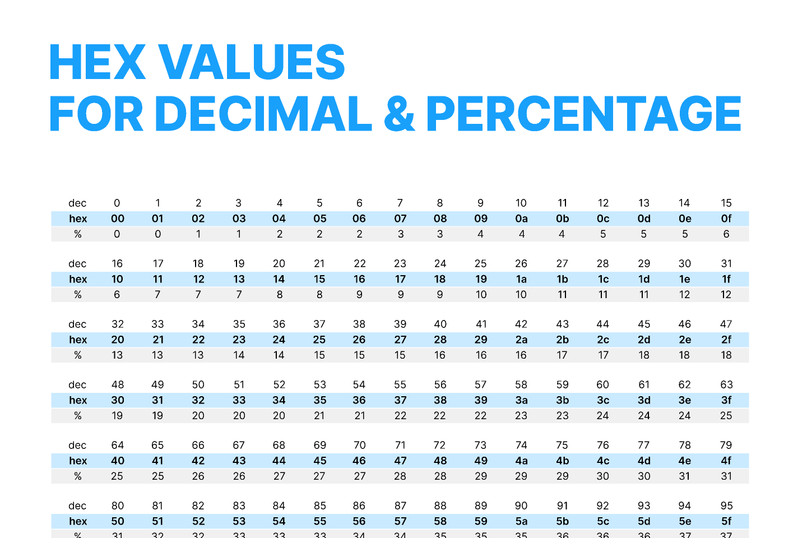

சரி 👍
நீ கேட்ட மாதிரி **deep-ஆ, concept புரியும் வகையில்** Hexadecimal system-ஐ அடிப்படையிலிருந்து பார்ப்போம்.

---

# 1️⃣ Number System என்றால் என்ன?

Number system என்றால் **எத்தனை symbols (digits) பயன்படுத்தி numbers எழுதுகிறோம்** என்பதுதான்.

Example:

நாம் தினமும் பயன்படுத்துவது:

```
0 1 2 3 4 5 6 7 8 9
```

இதில்:

```
10 symbols
```

அதனால் இந்த system:

```
Decimal system (Base-10)
```

---

# 2️⃣ Base என்றால் என்ன?

ஒரு number system-ல் பயன்படுத்தப்படும் **symbols count = base**

```
Base = number of unique digits
```

Example:

| System      | Base | Digits  |
| ----------- | ---- | ------- |
| Binary      | 2    | 0,1     |
| Decimal     | 10   | 0–9     |
| Hexadecimal | 16   | 0–9,A–F |

---

# 3️⃣ Hexadecimal என்றால் என்ன?

Hexadecimal:

```
Base-16 number system
```

அதாவது:

```
ஒரு position-ல் 16 possible values
```

Digits:

```
0 1 2 3 4 5 6 7 8 9
A B C D E F
```

---

# 4️⃣ ஏன் A,B,C,D,E,F பயன்படுத்துகிறோம்?

Decimal digits:

```
0 1 2 3 4 5 6 7 8 9
```

இது:

```
10 digits
```

ஆனால் Hex-ல் தேவை:

```
16 digits
```

அதனால்:

```
0–9 = 10 digits
```

இன்னும்:

```
6 digits தேவை
```

அதற்கு programmers decide செய்தது:

```
A = 10
B = 11
C = 12
D = 13
E = 14
F = 15
```

இது **just naming convention**.

---

# 5️⃣ Hex digits table

| Hex | Decimal |
| --- | ------- |
| 0   | 0       |
| 1   | 1       |
| 2   | 2       |
| 3   | 3       |
| 4   | 4       |
| 5   | 5       |
| 6   | 6       |
| 7   | 7       |
| 8   | 8       |
| 9   | 9       |
| A   | 10      |
| B   | 11      |
| C   | 12      |
| D   | 13      |
| E   | 14      |
| F   | 15      |



---

# 6️⃣ Position value concept

Decimal-ல்:

```
347
```

meaning:

```
3 × 10²
4 × 10¹
7 × 10⁰
```

---

Hex-ல்:

```
2F
```

meaning:

```
2 × 16¹
F × 16⁰
```

F = 15

So:

```
2 × 16 = 32
+
15
=
47
```

---

# 7️⃣ Example conversion

Hex:

```
A3
```

meaning:

```
A × 16¹
+
3 × 16⁰
```

A = 10

```
10 × 16 = 160
+
3
=
163
```

---

# 8️⃣ Binary ↔ Hex relationship

Computer binary பயன்படுத்துகிறது:

```
0 1
```

Binary numbers long ஆக இருக்கும்.

Example:

```
11111111
```

இதைக் Hex-ஆ convert செய்தால்:

```
FF
```

Rule:

```
1 hex digit = 4 bits
```

Example:

Binary:

```
0010 0011
```

Split:

```
0010 = 2
0011 = 3
```

Hex:

```
23
```

---

# 9️⃣ Example (ASCII case)

Character:

```
#
```

ASCII decimal:

```
35
```

Binary:

```
00100011
```

Hex:

```
23
```

So:

```
# = 35 decimal
# = 0x23 hex
# = 00100011 binary
```

---

# 🔟 0x prefix என்ன?

Programming languages-ல்:

```
0x
```

என்றால்:

```
இந்த number hexadecimal
```

Example:

```
10   → decimal 10
0x10 → hex 10
```

Hex 10 meaning:

```
1 × 16¹
+
0 × 16⁰
=
16 decimal
```

---

# 1️⃣1️⃣ Why programmers use hex?

Binary:

```
00100011
```

Decimal:

```
35
```

Hex:

```
23
```

Binary-க்கு nearest compact format:

```
Hexadecimal
```

அதனால்:

* memory dump
* machine code
* addresses

அனைத்தும் hex-ல் காட்டப்படும்.

---

# 1️⃣2️⃣ Real systems example

Memory dump:

```
00000000: 23 69 6E 63 6C 75 64 65
```

Meaning:

```
#include
```

---

# ⭐ Final summary

Hexadecimal:

```
Base-16 number system
```

Digits:

```
0–9 + A–F
```

Example:

```
0x23 = 35 decimal
0xFF = 255 decimal
```

Rule:

```
1 hex digit = 4 binary bits
```

---

💡 Next deep concept (CSAPP-க்கு மிகவும் முக்கியம்):

👉 **ஏன் 1 byte = 2 hex digits?**

Example:

```
23
69
6E
```

இந்த relation புரிந்தால் **memory dump முழுவதும் instant-ஆ read செய்ய முடியும்**.
